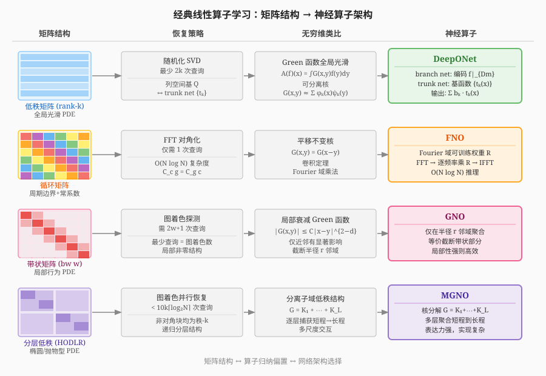

# 神经算子学习笔记
## SciML 的三大方向
  - PDE 求解器：已知方程，利用神经网络（借助自动微分技术）逼近其解
    - 核心思路：将 PDE 的残差作为损失函数，通过训练使网络满足方程约束（如 PINNs）
    - 自动微分使得对网络输出求偏导数变得高效，从而可直接在损失中嵌入微分方程
    - 也包含其他网络结构策略，如 deep Galerkin、deep Ritz（变分形式）等
  - PDE 发现：数据驱动地识别/恢复 PDE 的结构（系数、项的形式）
    - 假设方程形式已知（如候选项库），从数据中定量确定各项系数
    - 如 SINDy：用稀疏促进算法从候选函数库中筛选出真正起作用的项
    - 也有符号回归方法（AI Feynman、遗传算法）直接从数据发现方程形式
  - 算子学习：本文重点，从数据中逼近未知算子
## 算子学习与神经算子理论描述

### 数学定义
- 设 $\Omega \subset \mathbb{R}^d$，$\mathcal{U}$、$\mathcal{V}$ 为定义在 $\Omega$ 上的函数空间（如 $L^2(\Omega)$），算子 $A: \mathcal{U} \to \mathcal{V}$（可能非线性）满足 $A(f) = u$
- 学习目标：找到近似算子 $\hat{A}: \mathcal{U} \to \mathcal{V}$，使其在输入函数分布 $\mu$ 上的期望损失最小：
  $$\min_{\theta \in \mathbb{R}^N} \int_{\mathcal{U}} \mathcal{L}\bigl(\hat{A}(f;\theta),\, A(f)\bigr)\, d\mu(f)$$
  其中 $\mathcal{L}: \mathcal{V} \times \mathcal{V} \to \mathbb{R}_{\geq 0}$ 为函数空间上的度量（如 $\|\cdot\|_{L^2(\Omega)}^2$）
- 典型例子：Poisson 方程的解算子 $A(f)(x) = \int_\Omega G(x,y)f(y)\,dy$，$G$ 为 Green 函数
### 离散化
算子学习涉及三个层面的离散化：**输入/输出函数**（含分布与实例两个层次）、**算子本身**。
- 函数的离散化：连续函数（及其分布）的离散化本质上依赖某种蕴含有限性的数学假设，涉及两个层次：
  - 分布层次：连续分布 $\mu$ 在 $\mathcal{U}$ 上无法直接处理，需从中取有限样本 $\{f_i\}_{i=1}^M \subset \mathcal{U}$（及对应输出 $\{u_i\}_{i=1}^M$，满足 $u_i = A(f_i)$），以经验分布 $\mu_M = \frac{1}{M}\sum_{i=1}^M \delta_{f_i}$ 代替，学习目标退化为：
    $$\min_{\theta \in \mathbb{R}^N} \frac{1}{M}\sum_{i=1}^M \mathcal{L}\bigl(\hat{A}(f_i;\theta),\, u_i\bigr)$$
  - 函数实例层次：每个连续函数 $f_i$ 本身仍需进一步离散为有限维向量才能输入网络，主要有两种方式：
    - 方式一（点采样）：当 $f$ 满足特定连续性（如 $f \in L^2(\Omega)$ 或 Sobolev 空间 $H^s(\Omega)$）时，可在 $\Omega$ 上取传感器点 $D_m = \{x_1,\dots,x_m\} \subset \Omega$，将 $f$ 离散为观测向量 $f|_{D_m} = (f(x_1),\dots,f(x_m)) \in \mathbb{R}^m$
      - 每对训练数据在同一组传感器点上采样：$f_i|_{D_m}$，$u_i|_{D_m}$
      - 传感器点数 $m$ 决定离散化精度；当 $m \to \infty$（网格细化）时，离散化趋近连续极限——这是"离散化不变性"的核心要求，严格定义为：一个参数化算子类 $G(\cdot,\theta)$ 称为离散化不变的，若存在一族离散化映射 $\hat{G}_L$，使得对任意紧集 $K \subset \mathcal{U}$、任意参数 $\theta$：
        $$\lim_{L\to\infty} \sup_{a\in K} \|\hat{G}_L(D_L, a|_{D_L}, \theta) - G(a,\theta)\|_U = 0$$
      - 借助紧嵌入定理、插值估计等工具可对离散化误差给出收敛性保证
    - 方式二（代理模型参数化）：用一套参数化代理模型逼近函数，以代理模型的参数向量作为网络输入；此时有限性来自模型的参数维度，而非物理空间的采样密度
      - 例如有限元展开：$f(x) \approx \sum_{k=1}^K c_k \phi_k(x)$，以系数向量 $(c_1,\dots,c_K) \in \mathbb{R}^K$ 作为输入
      - 例如隐式神经表示（INR）：用一个小型神经网络 $f_\phi(x) \approx f(x)$ 拟合单个函数实例，以网络权重 $\phi \in \mathbb{R}^K$ 作为该函数的有限维编码；此时函数空间的连续性假设转化为对 INR 网络结构和训练的正则化约束
- 算子的离散化：连续算子 $A: \mathcal{U} \to \mathcal{V}$ 在有限维离散化后，退化为从离散输入到离散输出的有限维映射。设输入输出均在同一组网格点 $D_m = \{x_1,\dots,x_m\}$ 上采样，则：
  - **经典离散化**：连续积分算子 $A(f)(x) = \int_\Omega K(x,y)f(y)\,dy$ 经数值求积（如梯形公式，权重 $w_j$）退化为矩阵-向量乘积：
    $$A(f)(x_i) \approx \sum_{j=1}^m w_j K(x_i, x_j) f(x_j) = (\mathbf{K}\mathbf{f})_i, \quad \mathbf{K}_{ij} = w_j K(x_i,x_j)$$
    即连续算子 $\leftrightarrow$ 矩阵 $\mathbf{K} \in \mathbb{R}^{m\times m}$，计算代价 $O(m^2)$
  - **神经算子的离散化**：将参数化算子 $\hat{A}(\cdot;\theta)$ 本身也离散化为 $\hat{A}_m(\cdot;\theta)$，作用在离散输入 $f|_{D_m}$ 上输出离散向量 $u|_{D_m}$；不同架构对算子施加不同结构假设以降低复杂度：
    - 低秩假设（DeepONet）：$\mathbf{K} \approx \mathbf{T}\mathbf{B}^\top$，$\mathbf{T},\mathbf{B} \in \mathbb{R}^{m\times p}$，复杂度 $O(mp)$
    - 平移不变假设（FNO）：$\mathbf{K}$ 为循环矩阵，经 FFT 对角化，复杂度 $O(m\log m)$
    - 局部截断假设（GNO）：$\mathbf{K}$ 为带状稀疏矩阵，复杂度 $O(m \cdot w)$，$w$ 为带宽
    - 分层低秩假设（MGNO）：$\mathbf{K}$ 为 HODLR 结构，复杂度 $O(m\log m)$
  - 总误差分解：
    $$\|\hat{A}_m(f|_{D_m};\theta) - A(f)\|_{\mathcal{V}} \leq \underbrace{\|\hat{A}_m(f|_{D_m};\theta) - \hat{A}(f;\theta)\|_{\mathcal{V}}}_{\text{离散化误差}} + \underbrace{\|\hat{A}(f;\theta) - A(f)\|_{\mathcal{V}}}_{\text{逼近误差}}$$
    - 离散化不变性保证离散化误差随 $m \to \infty$ 趋于 $0$
    - 通用逼近定理保证存在参数 $\theta$ 使逼近误差任意小
### 神经算子
- 标准全连接网络输入输出为有限维向量：$\mathcal{N}(x) = \sigma(A_L(\cdots\sigma(A_1 x+b_1)\cdots)+b_L)$；神经算子将其推广至函数空间之间的映射，输入 $f:\Omega\to\mathbb{R}^{d_1}$，输出 $u:\Omega\to\mathbb{R}^{d_L}$
- 每一层由积分算子与非线性激活复合定义：
  $$u_{i+1}(x) = \sigma\!\left(\int_{\Omega_i} K^{(i)}(x,y)\,u_i(y)\,dy + b_i(x)\right), \quad x \in \Omega_{i+1}$$
  - $K^{(i)}$ 为第 $i$ 层核函数，$b_i$ 为偏置函数，均通过训练参数化
  - 与标准网络类比：权重矩阵 $A_i$（矩阵乘）$\to$ 积分算子，偏置向量 $\to$ 偏置函数
  - $\Omega_i \subset \mathbb{R}^{d_i}$ 为第 $i$ 层对应的紧致空间域（各层可不同）
- 核心挑战：积分算子朴素离散化计算代价为 $O(m^2)$，由此衍生出 DeepONet、FNO 等架构以降低复杂度
- 完整架构（Kovachki et al. 2022）：提升（Lifting）→ 迭代核积分（Iterative Kernel Integration）→ 投影（Projection）
  $$G_\theta := Q \circ \sigma_T(W_{T-1} + K_{T-1} + b_{T-1}) \circ \cdots \circ \sigma_1(W_0 + K_0 + b_0) \circ P$$
  - 提升层 $P$：逐点映射 $a(x) \mapsto v_0(x)$，将输入函数升至高维隐空间（$d_{v_0} > d_a$）
  - 每层隐层更新同时包含局部线性算子 $W_t$（逐点矩阵乘，类比 ResNet 跳跃连接）和非局部积分核算子 $K_t$（捕获长程依赖）：
    $$v_{t+1}(x) = \sigma_{t+1}\!\left(W_t v_t(x) + \int_{D_t} \kappa^{(t)}(x,y)\,v_t(y)\,d\nu_t(y) + b_t(x)\right)$$
  - 投影层 $Q$：逐点映射 $v_T(x) \mapsto u(x)$，降回输出维度
  - 总误差分解：
    $$\|\hat{G}_\theta(a|_{D_L}) - G^\dagger(a)\|_U \leq \underbrace{\|\hat{G}_\theta(a|_{D_L}) - G_\theta(a)\|_U}_{\text{离散化误差}} + \underbrace{\|G_\theta(a) - G^\dagger(a)\|_U}_{\text{逼近误差}}$$
    - 离散化不变性定理保证离散化误差随网格细化趋于 0
    - 通用逼近定理保证存在参数使逼近误差任意小
## 经典线性算子学习
  - 线性 PDE 的解算子离散化后退化为矩阵-向量乘积 $x \mapsto Ax$，$A \in \mathbb{R}^{N \times N}$ 由 Green 函数（卷积中的核函数）离散得到
  - PDE 的性质决定 $A$ 的结构：全局光滑 $\to$ 低秩；周期边界+常系数 $\to$ 循环矩阵；局部行为 $\to$ 带状；椭圆/抛物型 $\to$ 分层低秩
  - 矩阵恢复问题：$A$ 视为黑盒，仅通过矩阵-向量积 $x \mapsto Ax$、$x \mapsto A^\top x$ 探测，目标是用尽量少的查询次数还原 $A$
    - 朴素方法：查询 $Ae_j$（$j=1,\dots,N$）逐列还原，需 $N$ 次；利用结构可大幅减少，下界由结构决定
    - 偏好高斯随机向量作为探测输入，因为其无穷维类比恰好是高斯过程——算子学习中常用的训练输入分布
  - 此框架为神经算子架构设计提供直觉：矩阵结构 $\leftrightarrow$ 算子归纳偏置 $\leftrightarrow$ 网络架构选择
  - 低秩矩阵恢复 $\to$ DeepONet
    - 秩-$k$ 矩阵至少需 $2k$ 次查询；随机化 SVD 以概率 1 用 $2k$ 次恢复
    - 必须用随机算法，确定性输入无法避免落入零空间
    - 列空间基 $Q$ $\leftrightarrow$ trunk net 基函数 $\{t_k\}$；坐标系数 $Z$ $\leftrightarrow$ branch net 输出 $\{b_k\}$
  - 循环矩阵恢复 $\to$ FNO
    - 循环矩阵由向量 $c \in \mathbb{R}^N$ 完全参数化，仅需 1 次查询即可恢复
    - 利用 $C_c g = C_g c$，FFT 在 $O(N\log N)$ 内求解；无穷维类比为平移不变核
    - FNO 在 Fourier 域用可训练权重 $R$ 参数化核，FFT 加速积分运算
  - 带状矩阵恢复 $\to$ GNO
    - 带宽 $w$ 的带状矩阵需 $2w+1$ 次查询；最少查询数等于对应图的着色数
    - 无穷维类比为局部衰减的 Green 函数（$|G(x,y)| \leq C|x-y|^{2-d}$）
    - GNO 仅在半径 $r$ 邻域内聚合，等价于截断带状部分；局部性强则快，非局部时性能下降
  - 分层低秩矩阵（HODLR）恢复 $\to$ MGNO
    - 对角块递归为 HODLR，非对角块均为秩-$k$；图着色使同色子矩阵并行恢复，总查询数 $< 10k\lceil\log_2 N\rceil$
    - 无穷维类比为椭圆/抛物型 PDE 的 Green 函数在分离子域上的低秩结构
    - MGNO 将核分解为 $G = K_1 + \cdots + K_L$，逐层捕获从短程到长程的交互；表达能力强但实现复杂
  - 示意图：
## 神经算子架构总览
  - 各架构通过对核施加不同结构假设来降低计算复杂度，并具有通用逼近性（类比神经网络的万能逼近定理）及基于逼近论的定量误差界
  - DeepONet：假设算子低秩，用 branch/trunk 网络参数化核
    - 结构：branch net 将输入函数 $f$ 在传感器点 $\{x_i\}_{i=1}^m$ 处的值编码为系数向量 $\{b_k\}_{k=1}^p$；trunk net 学习输出域上的基函数 $\{t_k\}_{k=1}^p$；输出为秩-$p$ 展开：$$\mathcal{N}(f)(y) = \sum_{k=1}^p b_k(f(x_1),\dots,f(x_m))\, t_k(y)$$
    - 与低秩 SVD 的对应：$\{t_k\}$ $\leftrightarrow$ 左奇异向量（列空间基），$\{b_k\}$ $\leftrightarrow$ 坐标系数；$p$ 控制逼近秩
    - 训练：监督学习，损失为在随机位置 $\{y_j\}$ 上的 Monte-Carlo 近似 MSE：$$\min_\theta \frac{1}{|\text{data}|}\sum_{(f,u)} \frac{1}{n}\sum_{j=1}^n |\mathcal{N}(f)(y_j) - u(y_j)|^2$$
    - 离散化不变性：trunk net 可在 $\Omega$ 上任意点求值（输出端无关离散化）；但原始 branch net 依赖固定传感器点，不具备输入端离散化不变性；修复方案：低秩神经算子、局部空间平均、PCA 替代 branch net
    - 理论保证：满足通用算子逼近定理（Chen & Chen 1995），可逼近任意连续算子；已有针对 Burgers 方程、对流扩散方程、非线性抛物型 PDE 的定量误差界
    - 衍生架构：
      - POD-DeepONet / SVD-DeepONet：用 POD 或 SVD 显式构造 trunk net 基函数 $\{t_k\}$，强化与低秩分解的对应关系，提升可解释性
      - 特征扩展变体：对 trunk net 输入做 $y \mapsto (y, \cos\pi y, \sin\pi y, \dots)$ 展开，以捕捉数据中的振荡模式
    - remark：函数作为输入需整体被感知，但网络只能接收有限维向量，故必须预先在固定传感器点采样将 $f$ 离散化为 $(f(x_1),\dots,f(x_m))$ 再输入
  - FNO：假设算子平移不变，用 Fourier 系数参数化核
    - 结构：将核限制为平移不变 $K^{(i)}(x,y) = k^{(i)}(x-y)$，利用卷积定理将积分化为 Fourier 域逐点乘法：$$\int_{\Omega} k^{(i)}(x-y)u\,dy = \mathcal{F}^{-1}(R \cdot \mathcal{F}(u))(x)$$其中 $R$ 为可训练 Fourier 系数向量，截断至 $k_{\max}$ 个模式
    - remark：空间域上的卷积等价于频率域的乘法；频率域的卷积等价于空间域上的点乘
    - 每层更新：$$v_i = \sigma\!\left(W_i v_{i-1} + \mathcal{F}^{-1}(R_i \cdot \mathcal{F}(v_{i-1})) + b_i\right)$$其中 $W_i$ 为局部线性变换，$\sigma$ 逐点作用（如 ReLU）
    - 整体架构：$f \xrightarrow{P} v_0 \xrightarrow{\text{Fourier layers}} v_T \xrightarrow{Q} u$，$P$ 升维，$Q$ 降维投影
    - 复杂度：均匀网格 $m$ 点下 FFT 使积分代价从 $O(m^2)$ 降至 $O(m\log m)$；截断至 $k_{\max} \ll m$ 模式可进一步降低训练代价（适用于光滑函数，Fourier 系数指数衰减）
    - 离散化不变性：参数直接在 Fourier 空间学习，可在物理空间任意点求值（投影到基函数 $e^{2\pi i\langle x,k\rangle}$），天然支持不同分辨率迁移
    - 理论保证：通用算子逼近定理成立；但对粗糙函数（Fourier 系数仅对数衰减）所需参数量随精度 $\varepsilon \to 0$ 指数增长；对光滑 PDE 解（如 Darcy flow、Navier-Stokes）可利用 Sobolev 嵌入导出次线性增长的参数界
    - 局限性：
      - FFT 要求均匀网格与矩形域；非规则域需嵌入/插值，损失精度
      - 仅对平移不变核高效；变系数 PDE 的解算子不满足此假设
      - 非光滑数据（含间断）会出现 Gibbs 现象（Fourier 截断导致的振荡）
    - 衍生架构：
      - SNO（谱神经算子）：直接在 Fourier/Chebyshev 系数空间用前馈网络做映射
      - CNO（卷积神经算子）：在物理空间参数化 $k\times k$ 网格上的卷积核 $\sum_{i,j} k_{ij} f(x - z_{ij})$，缓解 CNN 的混叠问题，适用于带限函数间的映射
      - Transformer 与神经算子的关系
        - self-attention 是神经算子的特殊情况（取非线性核 $\kappa_v(x,y,v(x),v(y))$，Monte-Carlo 离散化后精确还原标准 attention）
        - 连续极限下 attention 对应：$$u(x) = \sigma v(x) + \int_D \frac{\exp\langle Av(x), Bv(y)\rangle/\sqrt{m}}{\int_D \exp\langle Av(s), Bv(y)\rangle/\sqrt{m}\,ds}\, Rv(y)\,dy$$
        - 多头 attention = 核为多个 $g_v R$ 之和的神经算子层
        - 但标准 attention 计算代价高（嵌套积分），且 ViT 等因使用 CNN patch embedding 而不是离散化不变的
  - GL / DGN：直接在物理空间学习 Green 核，不施加低秩或平移不变假设
    - 适用场景：线性边值问题 $Lu = f$（$u|_{\partial\Omega}=0$），解算子可表示为 $A(f)(x) = \int_\Omega G(x,y)f(y)\,dy$
    - GL（线性算子）：将 $G(x,y)$ 参数化为有理神经网络（激活函数为两多项式之比，系数在训练中学习），损失为相对均方误差：$$\min_{\theta} \frac{1}{|\text{data}|} \sum_{(f,u)} \frac{1}{\|u\|^2_{L^2}} \int_\Omega \left( u(x) - \int_\Omega \mathcal{N}(x,y) f(y)\,dy \right)^2 dx$$
      - remark：$m$ 为空间离散化点数；两层积分均用数值求积（如梯形公式）实现，内层积分对每个 $x_i$ 展开为 $\hat{u}(x_i) \approx \sum_{j=1}^m w_j \mathcal{N}(x_i,x_j)f(x_j)$，共 $m$ 个 $x_i$，故总代价 $O(m^2)$；由于核 $\mathcal{N}(x,y)$ 不假设平移不变性（即不要求 $\mathcal{N}(x,y)=k(x-y)$），无法化为卷积，无法用 FFT 加速——这正是相比 FNO 的主要计算劣势
      - 有理网络动机：比 ReLU 网络逼近连续函数所需层数指数级更少，且可取任意大值——适合逼近可能无界/奇异的 Green 函数
      - remark（有理神经网络）：标准神经网络的激活函数（如 ReLU、tanh）为固定的初等函数；有理神经网络将激活函数替换为有理函数 $\sigma(x) = p(x)/q(x)$，其中 $p,q$ 为多项式，系数在训练中与网络权重一同学习；有理函数类比于 Padé 逼近，相比多项式（对应 tanh/sigmoid 的 Taylor 展开）对含极点的函数有更强的局部逼近能力，且值域无界
    - DGN（非线性算子）：当 $A$ 非线性时，无法直接写成 Green 积分形式
      - 用双自编码器学习可逆坐标变换，将非线性边值问题线性化
      - 线性化后的算子用矩阵（离散 Green 函数）或结合 GL 的神经网络逼近
      - 已成功应用于非线性三次 Helmholtz 方程和非 Sturm-Liouville 方程
    - 优势：核可直接可视化与分析，可解释性强（可恢复 PDE 的对称性等性质）
    - 代价：双重积分离散化需精确求积，复杂度为 $O(m^2)$，高于 FNO 的 $O(m\log m)$
    - 相关方法：
      - BI-GreenNet / BINN / Deep Generalized Green's Functions：同样用深度学习恢复 Green 函数，但依赖 PINN 技术，需预先知道 PDE 算子形式
      - RKHS 方法（Stepaniants 2023）：在再生核 Hilbert 空间框架下学习线性 PDE 的 Green 核，损失函数为凸函数，理论性质更好
  - GNO：假设算子局部（Green 核对角线外快速衰减），用消息传递网络参数化
    - 适用场景：一致椭圆散度形式算子 $Lu = -\text{div}(A(x)\nabla u) = f$，满足一致椭圆条件 $A(x)\xi\cdot\xi \geq \lambda|\xi|^2$
    - 核心思路：用半径 $r$ 的球 $B(x,r)$ 截断积分，将全局积分近似为局部聚合：$$A(f)(x) \approx \int_{B(x,r)} G(x,y)f(y)\,dy$$
      - 截断核定义：$G_r(x,y) = G(x,y)$ 若 $|x-y|\leq r$，否则为 $0$
    - 理论依据：Green 函数满足逐点衰减界（Grüter-Widman 1982）：$$|G(x,y)| \leq C(d,A)|x-y|^{2-d}, \quad d\geq 3$$
      - 对截断误差积分得 $\|G - G_r\|_{L^2(\Omega\times\Omega)} \leq |\Omega|C(d,A)r^{2-d}$，随 $r$ 增大代数衰减
      - remark：误差界随维度 $d$ 增大而改善（指数 $2-d$ 更负），即高维时截断更有效；类似界对 $d=2$ 及抛物型 PDE 也成立
    - 实现：将 $\Omega$ 离散为图（节点 = 空间位置），仅连接距离 $\leq r$ 的节点对，用消息传递网络（message passing）做邻域平均聚合
      - remark（图的作用）：图将物理空间中的局部邻域关系编码为稀疏边集，节点 = 空间坐标，边 = 满足 $|x_i - x_j| \leq r$ 的节点对；消息传递在此图上运行即自动实现积分截断 $\int_{B(x,r)}$
    - 与带状矩阵恢复的对应：截断半径 $r$ $\leftrightarrow$ 矩阵带宽 $w$；邻域聚合 $\leftrightarrow$ 带状部分的矩阵-向量积
      - remark（带状矩阵）：带状矩阵是上述图连接关系的矩阵呈现——第 $i$ 行非零列恰为节点 $i$ 的邻居集，带宽 $w$ $\leftrightarrow$ 截断半径 $r$
    - 局限：局部性强时高效；若解算子具有长程交互（带宽大）则性能下降
  - MGNO：假设算子非对角低秩（多尺度），将 Green 核分层分解为低秩核之和
    - 核心思路：将 Green 核分解为 $G = K_1 + \cdots + K_L$，各层捕获不同尺度的交互（$K_1$ 对应最短程交互，稀疏但满秩；$K_L$ 对应最长程交互，稠密但低秩）
      - remark：MGNO 与 GNO 的本质区别不只是多尺度，而是理论基础的升级——GNO 截断长程（误差代数衰减），MGNO 用低秩逼近保留长程（每个子域上误差指数衰减），二者处理长程交互的策略根本不同
    - DeepONet 的局限（动机）：Weyl 定律指出一致椭圆算子的特征值以代数速率衰减 $\lambda_n \sim cn^{-2/d}$，故全局最优秩-$k$ 逼近误差也仅代数衰减，高维时更慢；DeepONet 的特征向量长度 $p$ 需极大才能达到给定精度
    - 关键理论（Bebendorf-Hackbusch 2003）：Green 函数 $G$ 限制在满足强可容许条件 $\text{dist}(D_X, D_Y) < \text{diam}(D_Y)$ 的分离子域 $D_X \times D_Y$ 上时，存在秩-$k$ 可分逼近 $G_k(x,y) = \sum_{i=1}^k u_i(x)v_i(y)$，其中 $k = O(\log(1/\varepsilon)^{d+1})$，使得：$$\|G - G_k\|_{L^2(D_X \times D_Y)} \leq \varepsilon \|G\|_{L^2(D_X \times \hat{D}_Y)}$$
      - remark：强可容许条件要求两子域距离小于其中一个的直径，即两域"分离但不太远"；满足此条件时低秩逼近误差随秩指数衰减（而非全局低秩的代数衰减），这是 MGNO 相比 DeepONet 的核心优势
    - 实现：对 $\Omega \times \Omega$ 做层次树形分解，各子域满足可容许条件；从叶节点向根聚合各子域贡献，积分运算总复杂度为线性（关于子域数）
    - 与 HODLR 恢复的对应：层次分解 $\leftrightarrow$ HODLR 矩阵的递归块结构；各层低秩核 $\leftrightarrow$ 非对角低秩块
    - 代价：表达能力强但结构复杂，实现难度高；计算代价高于 GNO
    - 替代方案：
      - 小波神经算子（Wavelet NO）：用小波变换编码多尺度结构，无需构建层次网格，对高维或复杂域更友好
      - 基于自注意力的算子架构：受 Transformer 启发，用 self-attention 捕获全局相关性
        - Galerkin Transformer（Cao 2021）：在算子学习中引入 self-attention，基准测试优于 FNO
        - Kernel-Coupled Attention（Kissas 2022）：学习输出函数特征表示各分量间的相关性
        - GNOT（Hao 2023）：支持多输入函数与复杂网格的通用神经算子 Transformer
  - remark（神经算子架构的积分实现策略）
    - 第一类：将网络架构本身嵌入积分结构（DeepONet）
      - 不显式离散化积分核，而是用 branch/trunk 网络的乘积和直接参数化积分结果
      - 积分 $\int G(x,y)f(y)dy$ 被隐式表示为 $\sum_k b_k(f) \cdot t_k(x)$，即低秩展开
      - 网络权重即积分核的低秩因子，积分通过前向传播完成
    - 第二类：将积分化为频域逐点乘法（FNO）
      - 利用卷积定理：空间域卷积 $\int k(x-y)u(y)dy = \mathcal{F}^{-1}(\hat{k} \cdot \hat{u})(x)$
      - 积分核须满足平移不变性，方可化为卷积再经 FFT 转为频域乘法
      - 复杂度从 $O(m^2)$ 降至 $O(m\log m)$
    - 第三类：在物理空间或图结构上直接离散化积分（GL/DGN、GNO、MGNO）
      - GL/DGN：对全域二重积分做数值求积（如梯形公式），复杂度 $O(m^2)$；核无结构假设，不可用 FFT 加速
      - GNO：将积分域截断为局部邻域 $B(x,r)$，用图的消息传递实现稀疏聚合；本质是稀疏离散求和，非卷积
      - MGNO：对层次分解后各子域分别做低秩离散积分，再逐层聚合；多尺度稀疏求和，复杂度线性
      - 三者共同点：积分核在物理空间直接参数化，差异在于离散化的稀疏策略（全局稠密 / 局部截断 / 层次多尺度）
## 神经算子训练流程
  - 数据获取
    - 源项分布
      - remark：源项 $f$ 是 PDE 右端的强迫函数，如 $-\nabla^2 u = f$ 中的 $f$，表示外部驱动（热源、外力等），不同于边界条件或初值；但在时间依赖问题中，初始条件有时也作为算子输入被视为广义"源项"
      - 源项 $\{f_j\}$ 通常从高斯随机场（Gaussian Process, GP）中采样
      - GP 由均值函数 $\mu(x)$ 和协方差核 $K(x,y)$ 完全确定
      - 常用协方差核：
        - 平方指数核（SE核）：$K(x,y) = \exp(-|x-y|^2 / 2\ell^2)$，$\ell$ 为长度尺度参数
        - Matérn核：由参数 $\nu, \ell$ 控制采样函数的光滑度
        - Helmholtz方程Green核：$K = A(-\nabla^2 + cI)^{-\nu}$，可将物理先验嵌入源项分布
      - $\ell$ 越小，特征值衰减越慢，采样函数越振荡；$\ell$ 越大，函数越光滑
      - 实践中典型取值：$\ell \in [0.01, 0.1]$，传感器数 $m = 100$
    - 数值PDE求解器
      - 有限差分法（FDM）：实现简单，适合矩形区域，需均匀网格，代数收敛
      - 有限元法（FEM）：适合复杂几何和边界条件，网格灵活，代数收敛；常用软件 FEniCS、Firedrake
      - 谱方法：基函数全局支撑（Chebyshev/Fourier），指数收敛（谱精度），但仅适合简单几何；常用软件 Chebfun
      - 时间依赖PDE：先做时间离散（如后向Euler、Runge-Kutta），再做空间离散
    - 训练数据量
      - 通常只需约 $10^3$ 对输入-输出样本，远少于图像分类等任务
      - 原因：解算子具有高度结构性（低秩、稀疏等），可设计数据高效的架构
      - 收敛分两阶段：先指数速率快速下降，后代数速率缓慢下降并饱和（受离散误差和优化局部极小影响）
      - 理论上：对椭圆PDE，仅需 $O(\mathrm{polylog}(1/\varepsilon))$ 样本对即可将Green函数恢复至精度 $\varepsilon$
      - 对抛物型PDE（如热传导），可用 $O(\mathrm{poly}(1/\varepsilon))$ 样本恢复Green函数
  - 优化
    - 损失函数
      - MSE损失（DeepONet原始工作采用）：$$\mathcal{L}_{MSE} = \frac{1}{N}\sum_{i=1}^N \frac{1}{m}\sum_{j=1}^m |\hat{A}(f_i)(x_j) - u_i(x_j)|^2$$
      - 相对平方 $L^2$ 损失（梯形公式离散）：$$\mathcal{L} = \frac{1}{N}\sum_{i=1}^N \frac{\|\hat{A}(f_i) - u_i\|^2_{L^2}}{\|u_i\|^2_{L^2}}$$
      - 相对 $L^2$ 损失（FNO常用，归一化效果更好，测试误差可降低约一半）：$$\mathcal{L}_{L^2} = \frac{1}{N}\sum_{i=1}^N \frac{\|\hat{A}(f_i) - u_i\|_{L^2}}{\|u_i\|_{L^2}}$$
      - $L^1$ 损失：对异常值更鲁棒
      - Sobolev范数损失：当导数信息重要时使用（如 $H^1$ 损失）
      - 物理约束损失：在损失函数中加入PDE残差项（类似PINN）
    - 优化算法与实现
      - 主流优化器：Adam（默认学习率 0.001），或其变体 AdamW
      - 进阶策略：Adam 预训练 + L-BFGS 微调（两阶段训练），可提升小数据场景收敛
      - FNO训练中常使用学习率衰减策略
      - 实现框架：PyTorch、TensorFlow（支持GPU可微FFT）
      - 理论收敛分析尚不完善，NTK框架向神经算子的推广是开放问题
    - 测量收敛性与超分辨率
      - 性能评估：在未见数据上计算相对 $L^2$ 测试误差，当前SOTA约为 $1\%$–$10\%$
      - 注意：测试误差不能完全反映泛化能力（测试集与训练集同分布）
      - 外推性：神经算子对更光滑（更大 $\ell$）的函数有一定外推能力，但对更振荡的函数外推误差增大
      - 零样本超分辨率：在低分辨率训练后，可直接在更高分辨率评估，误差基本不变（在Burgers方程和Darcy流上验证）
      - 关于神经算子离散化不变性的进一步讨论见 ReNO
- 结论与未来挑战
  - 探针分布问题
    - 现有方法多用全局支撑、训练前固定分布的GP源项
    - 现实工程/生物系统中源项可能是局部化的，影响尚不明确
    - 未来方向：研究局部支撑源项的影响；引入自适应源项以针对特定任务微调，或实现高效迁移学习
  - 软件与数据集
    - 缺乏类似 MNIST/ImageNet 的标准化基准数据集和开源工具
    - 未来方向：建立跨学科（流体、量子力学、流行病学等）标准PDE问题列表，涵盖线性/非线性、稳态/时变、光滑/粗糙等多种属性
  - 真实世界应用
    - 算子往往非线性、高维，数据稀少或含噪，但正问题（forward problem）通常是适定的
    - 主要应用方向：
      - 加速求解：构建低成本代理模型，以精度换速度，适合需反复求解的工程场景
      - 参数优化：学好的解算子提供从解到参数的可微路径，支持逆问题求解；离散化无关性使模型可自由迁移至不同网格或分辨率
      - 基准测试：借助 PDE 理论（对称性、守恒律）开发和评估新架构
      - 发现未知物理：在 PDE 未知或数据极少时，从数据中挖掘物理规律；可解释性差是当前主要瓶颈
    - 已有成功案例：天气预报（FourCastNet、GraphCast），精度和速度均优于传统数值天气预报
    - 未来方向：扩展到更多科学领域，在真实数据（未知 PDE）上训练以发现新物理规律

  - 理论理解
    - 现有近似理论和样本复杂度分析已有进展，但收敛性和优化的理论仍不完善
    - 未来方向：将PINN的NTK收敛框架推广到神经算子，推导严格收敛率，设计更好的权重初始化方案
  - 物理性质保持
    - 现有神经算子高度非线性，难以解释，且通常不保证满足守恒律、对称性等物理约束
    - 未来方向：
      - 强约束：通过保结构架构直接嵌入物理性质
      - 弱约束：在损失函数中加入残差项
      - 发现新性质：从已训练的神经算子中反向提取PDE的对称性等（目前仅对线性PDE有效，非线性情形尚未解决）
      - 强化学习：优化后用RL技术施加物理约束（类比LLM中的RLHF）
